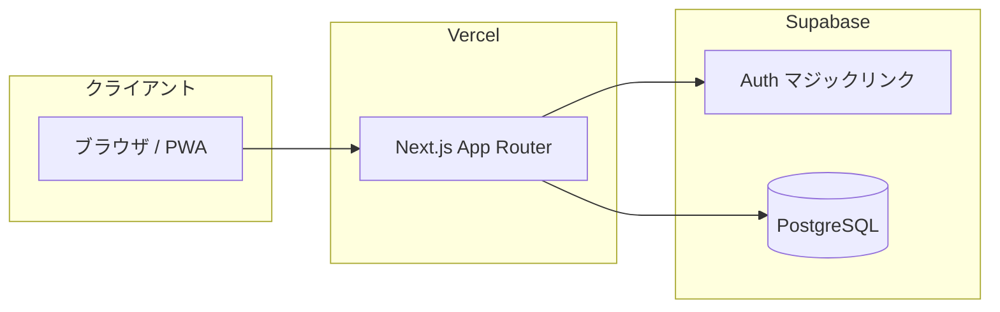

# チーム・コンディション・チェッカー 基本設計書

## 1. 文書情報

| 項目 | 内容 |
|------|------|
| システム名 | チーム・コンディション・チェッカー |
| 文書種別 | 基本設計書 |
| 参照要件 | `チーム・コンディション・チェッカー 要件定義書.md` |

## 2. 目的とスコープ

### 2.1 目的

要件定義書に定義された「3秒チェックイン」「マジックリンク認証」「個人／管理者ダッシュボード」を、Next.js（App Router）と Supabase／Prisma 上で実現するための論理構成・画面・データ・権限を確定する。

### 2.2 スコープ（本リリース対象）

| 区分 | 内容 |
|------|------|
| 対象 | Webアプリ（スマホ最優先）、PWA としてホーム画面追加 |
| 対象外（明示） | ネイティブアプリストア配信、チャット／工数管理との深い連携、人事システム連携、多言語対応（初期は日本語想定） |

### 2.3 利用形態の前提

- **単一テナント（1チーム）前提**で設計する。全登録ユーザーを同一チームとみなし、ピザ・メーター・参加率は「登録ユーザー全体」で集計する。
- 将来マルチチーム化する場合は `Team` エンティティと `User.teamId` の追加を別途基本設計で扱う。

## 3. システム構成

### 3.1 論理構成

- **認証**: Supabase Auth（メール・マジックリンク）。アプリはセッションを検証し、アプリ側 `User` レコードと突合する。
- **業務データ**: Prisma 経由で同一 PostgreSQL にアクセス（接続はサーバー側のみ。クライアントに DB 資格情報を渡さない）。

### 3.2 デプロイ

| 環境 | 用途 |
|------|------|
| Production | Vercel（リージョン: 東京想定）、Supabase（東京リージョン） |
| Local | Next.js dev、Supabase ローカルまたはリモートプロジェクトを `.env` で切替 |

### 3.3 環境変数（秘匿）

以下はリポジトリ・設計書に値を書かず、デプロイ先のシークレットまたはローカル `.env` のみで管理する。

- `DATABASE_URL`（Prisma 用接続文字列）
- `NEXT_PUBLIC_SUPABASE_URL`
- `NEXT_PUBLIC_SUPABASE_ANON_KEY`（またはプロジェクトが採用する公開キー名）
- サーバー専用の Supabase サービスロール等（使用する場合のみ）

## 4. 機能一覧

| ID | 機能名 | 概要 | 優先度 |
|----|--------|------|--------|
| F-01 | マジックリンクログイン | メール入力 → リンク送信 → コールバック後セッション確立 | 高 |
| F-02 | ユーザーオートプロビジョニング | 初回ログイン時に `User` を作成／既存なら紐付け | 高 |
| F-03 | プロフィール（表示名） | 設定画面で `User.name` を更新 | 高 |
| F-04 | チェックイン入力 | 6項目＋水曜のみ追加質問（将来拡張用フィールド） | 高 |
| F-05 | 個人ダッシュボード | 過去7日の推移、お天気図、AIアドバイス表示 | 高 |
| F-06 | チームメッセージ | 完了画面で `PositiveMessage` をランダム1件表示 | 中 |
| F-07 | ピザ・メーター | 参加率・元気度に応じたゲージと満タン時バッジ | 中 |
| F-08 | 管理者コンソール | 統計、FOG アラート一覧（管理者のみ） | 中 |
| F-09 | PWA | manifest、Service Worker、インストール誘導 | 中 |

## 5. 画面一覧と遷移

| 画面ID | 画面名 | パス（例） | 認証 |
|--------|--------|------------|------|
| SC-01 | ログイン（メール入力） | `/login` | 不要 |
| SC-02 | 認証コールバック | `/auth/callback` | 処理中 |
| SC-03 | ホーム／チェックイン | `/` または `/check-in` | 要 |
| SC-04 | チェックイン完了 | `/check-in/done` | 要 |
| SC-05 | マイダッシュボード | `/dashboard` | 要 |
| SC-06 | 設定 | `/settings` | 要 |
| SC-07 | 管理者コンソール | `/admin` | 要（role=admin） |

遷移の概要: 未ログインで保護ページ → `/login` → マジックリンク後 `SC-02` → `SC-03`。チェックイン送信後 `SC-04` → 任意で `SC-05`。

## 6. 権限設計

| ロール | `User.role` | 可能な操作 |
|--------|-------------|------------|
| 一般 | `user` | 自分のチェックイン、自分のダッシュボード、設定 |
| 管理者 | `admin` | 上記に加え `/admin` の閲覧（集計・FOG アラート） |

**管理者の付与**: 初期リリースでは DB またはシードで特定メールを `admin` に設定する方式を想定（管理 UI は後続でも可）。

## 7. データ設計（概念）

### 7.1 ER 概要

- **User** 1 — N **DailyReport**
- **PositiveMessage** はマスタ。チェックインとは非正規化で紐付けない（ランダム表示のため）。

### 7.2 テーブル対応

| 論理名 | 物理モデル名 | 備考 |
|--------|--------------|------|
| ユーザー | `User` | `email` unique、`role` |
| 日次レポート | `DailyReport` | 1ユーザー1日1件を推奨（ユニーク制約は詳細設計で定義） |
| ポジティブメッセージ | `PositiveMessage` | 文言マスタ |

### 7.3 チェックイン項目と格納値（論理）

各項目は要件の絵文字選択を **整数コード** にマップして保存する。コード値の対応表は詳細設計書に記載する。

### 7.4 水曜追加質問

`DailyReport` に任意項目（例: `wednesdayExtra Int?` または `extraAnswers Json?`）を持たせ、水曜のみ UI 表示・入力する。未入力日・他曜日は null。

### 7.5 ピザ・メーター

永続化は **サーバー側の集計結果をキャッシュ** するか、**当日分のみクライアント計算** するかを実装フェーズで選択。基本方針は「登録ユーザー数・当日チェックイン数・直近の元気度スコア」からゲージ割合を算出（算出式は詳細設計）。

## 8. 外部インタフェース

| 相手 | 内容 |
|------|------|
| Supabase Auth | マジックリンク送信、セッション JWT 検証 |
| （任意）AI API | 個人ダッシュの「AIアドバイス」生成。送信するデータ範囲・プロンプトは詳細設計で固定 |

## 9. 主要ビジネスルール

| ルールID | 内容 |
|----------|------|
| BR-01 | FOG アラート: 「濃霧」選択が **チェックインが存在する連続5日** で該当（欠席日は連続を切らない／切るかは詳細設計で1方式に固定） |
| BR-02 | 匿名メッセージは投稿者を画面上に表示しない。マスタ文のみ利用する場合は個人紐付けなし |
| BR-03 | パフォーマンス: 起動から入力完了まで10秒以内（うち操作3秒）を目標とし、計測は LCP／カスタムイベントで検証可能にする |

## 10. 非機能要件の対応方針

| 区分 | 方針 |
|------|------|
| セキュリティ | サーバーアクション／Route Handler で DB アクセス。管理者ページはミドルウェアまたはレイアウトで `role` 検証 |
| アクセシビリティ | タップ領域 44px 以上目安、コントラストは Tailwind のデフォルトを基準に確認 |
| 可用性 | Vercel／Supabase の SLA に依存。バックアップは Supabase 標準設定 |

## 11. 改訂履歴

| 版 | 日付 | 変更内容 |
|----|------|----------|
| 0.1 | 2026-05-01 | 初版 |
